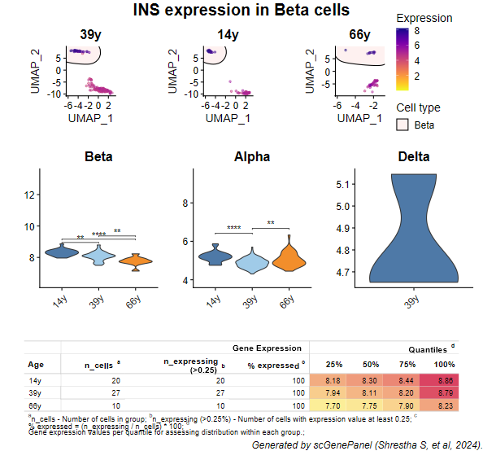
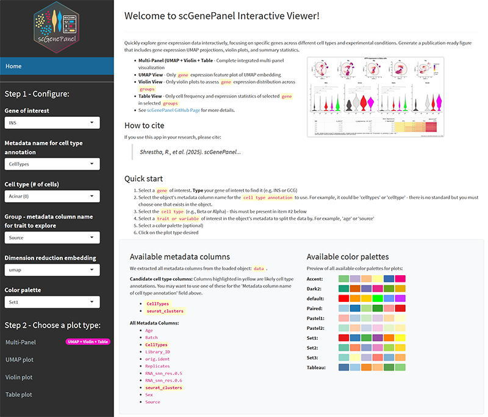

```{r setup, include = FALSE}
knitr::opts_chunk$set(
  echo = TRUE,
  message = FALSE,
  warning = FALSE,
  fig.width = 7,
  fig.height = 5
)

```

Source: `vignettes/scGenePanel.Rmd`

# Introduction

scGenePanel is an R package designed to visualize single-cell RNA-seq gene expression data. Specifically, it provides a multi-panel plot that allows users to visualize gene expression counts across different cell identities and types. This package is particularly useful for researchers interested in exploring gene expression patterns in single-cell datasets.

## Features of scGenePanel visual

-   A multi-panel plot that contains:
    -   UMAP : Visualize cluster of cells, split by cell identity of interest and highlight cell type of interest
    -   Violin plot : Visualize gene expression counts, colored by cell identity of interest, split by cell type of interest and significance test computed on cell identity of interest
    -   Tabular plot : Quantify cell counts, cell counts \>0.25, % expressed and quantiles of gene expression counts per cell identity of interest
-   Accepts two commonly used input data object (Seurat, SingleCellExperiment)
-   "Tableau" or "RColorBrewer" discrete qualitative color palettes options available
-   Order of cell identity of interest can be changed via group_order parameter
-   Shiny version to explore gene expression data interactively

## Installation

From Bioconductor
```{r eval=F, echo=T}
cat("Pending review")
```

From Github repository
```{r eval=F, echo=T}
library(devtools)
install_github("vandydata/scGenePanel")
```

From local source (Git clone)
```{r eval=F, echo=T}
install.packages("d:/data/scGenePanel", repos = NULL, type="source")
install.packages("/path/to/scGenePanel", repos = NULL, type = "source")
#with dependencies
install.packages("scGenePanel", repos = NULL, type = "source", dependencies = TRUE)
```

## Data included in this package

The package comes with two test datasets: Seurat and SingleCellExperiment objects. For this vignette, a Seurat dataset - `human_panc_islets.Rds` - is included in this package. This Seurat object contains single cell RNAseq data of human pancreatic islets from five healthy donors published in [Shrestha et al., JCI Insight (2021)](https://insight.jci.org/articles/view/151621) that has been <u>downsampled to 500 cells</u>. The complete dataset is available in [zenodo](https://zenodo.org/record/7626110). Also included in this package is a SCE dataset - `sce_object.Rds`.

Key annotations included in the metadata are:

-   `CellTypes` - cell types annotations
-   `Age` - donor age

## Load data

scGenePanel works with Seurat and SingleCellExperiment objects as the main input data. To load test data:

```{r}
seurat_object <- readRDS(system.file("extdata", "human_panc_islets.Rds", package="scGenePanel"))
sce_object <- readRDS(system.file("extdata", "sce_object.Rds", package="scGenePanel"))
```

Alternatively, you can use your own Seurat or SingleCellExperiment object.

## Create a multi-panel plot

```{r}
library(Seurat)

# Load the Seurat object
data <- readRDS(system.file("extdata", "human_panc_islets.Rds", package="scGenePanel"))

# Set the cell identity metadata
Idents(data) <- "CellTypes"

# Filter the dataset to include only specific cell identities and age of interest
data <- subset(x = data, idents = c("Alpha", "Beta", "Delta"))
data <- subset(x = data, subset = Age %in% c("14y", "39y", "66y"))

# Cell type distribution
table(data$CellTypes)

# Age distribution
table(data$Age)
```

`scgenepanel()` loads the multi-panel visual for the gene of interest among the cell identity of interest entered by parameter `meta_group` and cell type of interest entered by parameter `cell_type_name`.

```{r eval=F, echo=T}
library(scGenePanel)

scgenepanel(
    object = data,
    gene = "INS",
    meta_group = "Age",
    cell_type_name = "Beta",
    cell_type_colname = "CellTypes",
    col_palette = "Tableau",
    group_order = NULL,
    output_dir = ""
  )
```
{width=800px}

`scgenepanel_shiny()` launches a Shiny app, allowing for interactive exploration of the gene expression data. In this case, you only need to provide the data object, the parameters will be set interactively in the app.

* scGenePanel pre-fills your available cell type and group information, just pick the ones you want to visualize
* Several color palettes previews are available
* You can render the multi-plot or individual plots
* You can save both PNG and PDF versions of the plots

```{r eval=F, echo=T}
library(scGenePanel)

scgenepanel_shiny(object = data)
```
{width=800px}


# Session information

```{r}
sessionInfo()
```
